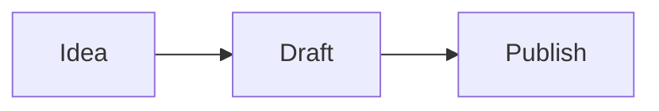

# Systems & Signals

A content-first technology blog built with Astro, Markdown/MDX, Tailwind CSS, and Mermaid. It generates a static site for GitHub Pages with light and dark themes.

## Run and build

Use Node.js 20.3+ (Node 22 LTS recommended).

```bash
npm install
npm run dev
npm run check
npm run build
npm run preview
```

Simulate a GitHub project-site build:

```bash
SITE_URL=https://YOUR_USERNAME.github.io BASE_PATH=/YOUR_REPOSITORY npm run build
```

## Write articles

Posts live in `src/content/posts/`. Create a draft with:

```bash
npm run new:post -- my-post-slug "My post title"
```

Required frontmatter:

```yaml
title: "Post title"
description: "Maximum 180 characters."
slug: "post-title"
publishedAt: 2026-09-12
category: "Software Design"
tags: [architecture]
cover: ../../assets/posts/my-cover.png
coverAlt: "Accessible image description"
featured: false
order: 0
draft: false
```

Allowed categories are `Frameworks`, `Software Design`, `AI`, `Industry`, `Career`, and `Field Notes`. Posts are sorted newest first; `order` breaks ties for posts on the same date. Draft posts are excluded everywhere.

## Add weekly learning notes

The **Learn** menu is for short, honest records of what you explored during the week. Add Markdown or MDX files under `src/content/learn/` with this frontmatter:

```yaml
title: "What I learned about ..."
slug: "what-i-learned-about"
week: "Week of 21 September 2026"
publishedAt: 2026-09-21
summary: "A short description of the week’s learning."
topics: [software design, AI]
draft: false
```

Each note can use the structure **What I explored**, **What changed my thinking**, and **What I want to try next**. The Learn archive is ordered newest first and each entry gets its own readable page.

Store images under `src/assets/posts/` and reference them relatively. Astro fingerprints them during builds, which keeps asset and CSS URLs correct on GitHub Pages.

Mermaid diagrams use normal fenced blocks:

````md

````

For video, use an `.mdx` article:

```mdx
import VideoEmbed from '../../components/VideoEmbed.astro';
<VideoEmbed src="https://www.youtube-nocookie.com/embed/VIDEO_ID" title="Video title" />
```

## Customize

- Edit `src/pages/about.astro` with your name and biography.
- Change navigation/footer content in `src/components/`.
- Change theme colors in `src/styles/global.css`.
- Replace `public/social-card.svg` and `public/favicon.svg`.

## Enable article comments with Giscus

Giscus uses GitHub Discussions, so comments stay attached to the repository and readers sign in with GitHub. The article layout already includes the comment area; it appears after the four public Giscus values are configured.

1. Enable **Settings → Features → Discussions** in the GitHub repository that stores this blog.
2. Visit [giscus.app](https://giscus.app), enter the repository, and install the Giscus GitHub App when prompted.
3. Choose the `Announcements` category (or another category you prefer), then copy the generated repository and category IDs.
4. For local development, copy `.env.example` to `.env` and fill in `PUBLIC_GISCUS_REPO`, `PUBLIC_GISCUS_REPO_ID`, and `PUBLIC_GISCUS_CATEGORY_ID`.
5. For GitHub Pages, add repository **Variables** under **Settings → Secrets and variables → Actions → Variables**:
   `GISCUS_REPO`, `GISCUS_REPO_ID`, `GISCUS_CATEGORY`, and `GISCUS_CATEGORY_ID`.

These are public configuration values, so use GitHub Actions Variables rather than encrypted Secrets. If they are empty, the site builds normally and simply omits the comments area until you configure them.

## Deploy to GitHub Pages

1. Push the repository to GitHub using the `main` branch.
2. Open **Settings → Pages**.
3. Select **GitHub Actions** as the source.
4. Push to `main` or manually run the deployment workflow.

The workflow detects user sites and project sites automatically and supplies Astro's base path, preventing broken CSS, image, or navigation URLs.
