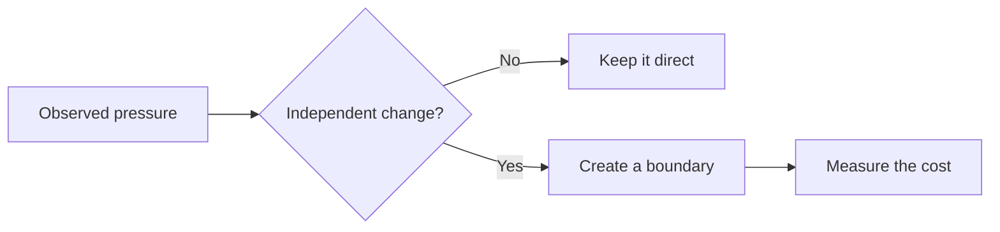

Software design is often described as the art of anticipating change. The harder part is deciding **which changes deserve to shape the system today**.

## Start with the pressure, not the pattern

Before choosing a pattern, name the pressure acting on the code:

- Does an external system change independently of us?
- Do teams need to release at different speeds?
- Is this business rule likely to acquire variants?
- Would failure need a different recovery strategy?

## Leave a seam, not a framework

A seam can be small: a function, module, or well-owned data structure. Small seams preserve options without asking the whole codebase to pay for them.

> The best design makes the next responsible change unsurprising.
