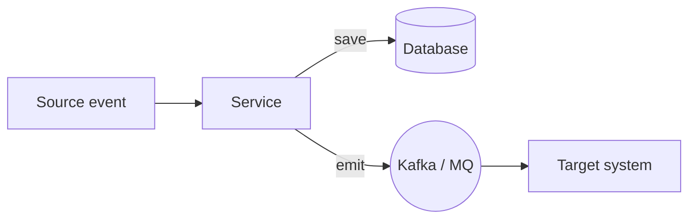
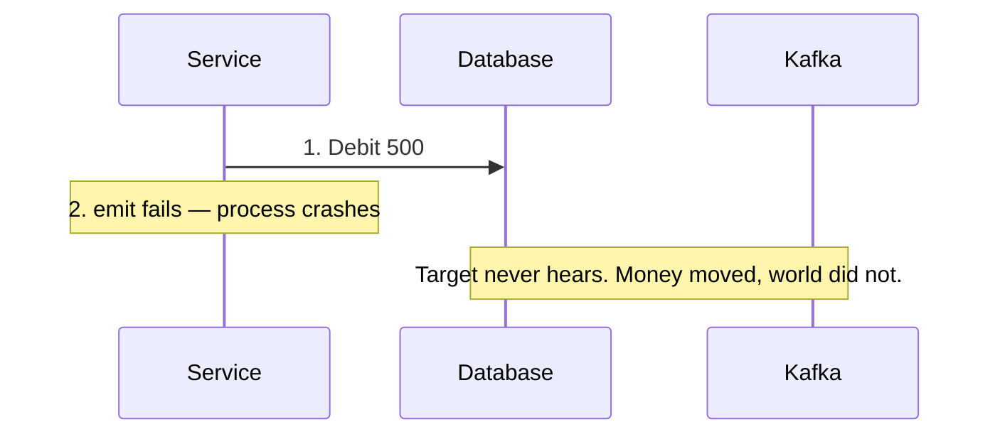
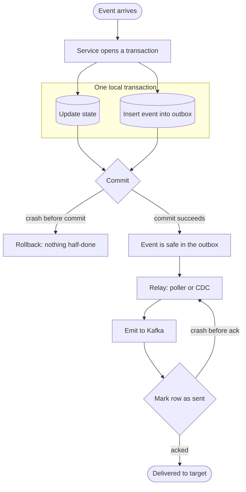

## One action, two destinations

A service receives an event. It must persist it **and** publish it onward. Two systems, no shared transaction:

Sounds trivial. It is the first trap of event-driven design, because **steps 1 and 2 are disconnected** — no transaction spans both.

## Three ways it breaks

### Save first, emit second

The debit is committed; the message is gone. In a payments flow that is a silent loss — the account is correct, but every downstream ledger, notification, and reconciliation is now wrong.

### Emit first, save second

The event is out, then the write fails. Retry the whole thing and the database has **no trace** of what was published — so it publishes again. **Ghost events**: no record, real consequences, repeated on every retry.

### Wrap both in one transaction?

You cannot — a database transaction does not reach into a broker. Even a staged `begin → save → emit → commit` fails if the process dies after emit but before commit: the database rolls back, the emitted message cannot be recalled. Ghost event again.

> Any two systems without a shared transaction can produce this: database ↔ broker, database ↔ email sender, database ↔ payment rail. The broker brand does not matter — Kafka, IBM MQ, ActiveMQ all behave the same at this seam.

## The fix: transactional outbox

Do both writes **inside one local transaction** — the state change plus an event row in an `outbox` table:

- Crash mid-transaction? **Rolls back together.** Nothing half-happened.
- Crash after commit? The event is safe in the outbox; the relay delivers it when the system is back up.

### The postbox analogy

The outbox is your **mailbox at home**: drop the letter in and it is committed. A **carrier** — a relay worker watching the outbox, or CDC (Debezium) tailing the database log — carries it to the **post office** (Kafka) for delivery. The service's job ends at the mailbox.

## The price: at-least-once

The relay can emit to Kafka and crash before marking the outbox row as sent. On restart it emits again — the same event reaches the target twice. This is inherent, not a bug: delivery is **at-least-once**, so consumers must **deduplicate** (idempotency keys, event IDs) before processing.

## Field note

I hit this exact seam building data-flow pipelines in the **payments domain** and around **SWIFT transaction networks** — two hops that must agree, with no shared transaction between them. The pattern is boring in the best way: it shows up wherever money and messaging touch.

## Where next

- The relay and the publisher are the same responsibility — when would you pick a **poller** over **CDC**, and what does reading the database log cost you?
- Where does deduplication live — inside each consumer, or a shared middleware layer every team reuses?
- What happens when the outbox grows faster than the relay can drain?

Next in this section: **CDC with Debezium**, then **event-carried state transfer**.
