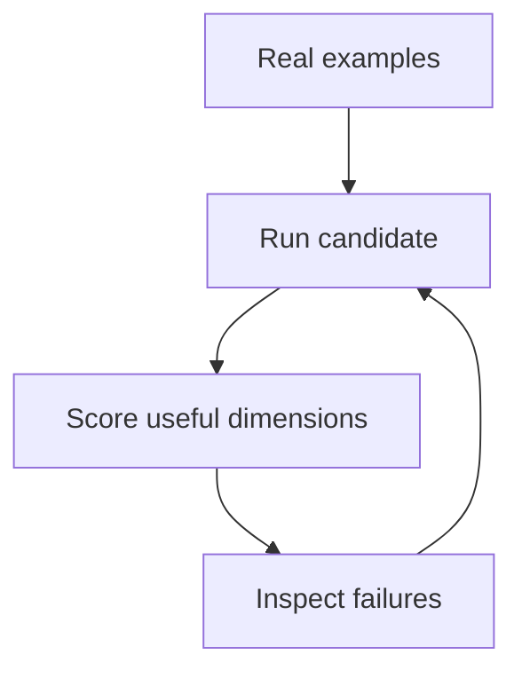

import VideoEmbed from '../../components/VideoEmbed.astro';

AI demos reward the happy path. Products are defined by everything around it: ambiguous input, incomplete context, latency, and model changes.

## Begin with real examples

Collect a small set of representative tasks from the actual workflow, including awkward cases.

<VideoEmbed src="https://www.youtube-nocookie.com/embed/aircAruvnKk" title="A visual introduction to neural networks" caption="Video embeds support YouTube or hosted video files." />

Store the model, parameters, prompts, retrieval settings, and evaluation-set version with every run.
